# Subscreen 

<!-- badges: start -->

<!-- badges: end -->

***subscreen*** (***sub***group ***screen***ing) package has been developed to systematically analyze data, e.g., from clinical trials, for subgroup effects and visualize the outcome for all evaluated subgroups simultaneously.
The visualization is done by a shiny application called Subgroup Explorer. Typically, shiny applications are hosted on a dedicated shiny server, but due to the sensitivity of patient data in clinical trials, which are usually protected by informed consents, the upload of this data to an external server is prohibited. Therefore, we provide our tool as a stand-alone application that can be launched from any local machine on which the data is stored. 

Table of content (click on topic to jump to a specific chapter):
<ul>
  <li> <a href='#chap1'> 1. Introduction </a></li>
  <li> <a href='#chap2'> 2. Package Functions </a></li>
    <li style='padding-left:2em'> <a href='#chap21'> 2.1 `subscreencalc` Input </a></li>
    <li style='padding-left:4em'> <a href='#chap211'> 2.1.1 data </a></li>
    <li style='padding-left:4em'> <a href='#chap212'> 2.1.2 eval_function </a></li>
    <li style='padding-left:4em'> <a href='#chap213'> 2.1.3 factors </a></li>
    <li style='padding-left:4em'> <a href='#chap214'> 2.1.4 max_comb </a></li>
    <li style='padding-left:4em'> <a href='#chap215'> 2.1.5 nkernel </a></li>
    <li style='padding-left:4em'> <a href='#chap216'> 2.1.6 par_functions </a></li>
    <li style='padding-left:4em'> <a href='#chap217'> 2.1.7 verbose </a></li>
    <li style='padding-left:4em'> <a href='#chap218'> 2.1.8 factorial </a></li>
    <li style='padding-left:4em'> <a href='#chap219'> 2.1.9 use_complement </a></li>
    <li style='padding-left:2em'> <a href='#chap22'> 2.2 `subscreencalc` Output </a></li>
    <li style='padding-left:2em'> <a href='#chap23'> 2.3 `subscreenvi` </a></li>
    <li style='padding-left:2em'> <a href='#chap24'> 2.4 `subscreenshow` </a></li>
  <li> <a href='#chap3'> 3. Subgroup Explorer </a></li>
    <li style='padding-left:2em'> <a href='#chap32'> 3.1 Upload </a></li>
    <li style='padding-left:2em'> <a href='#chap32'> 3.2 Explorer </a></li>
    <li style='padding-left:4em'> <a href='#chap321'> 3.2.1 Diagram </a></li>
    <li style='padding-left:4em'> <a href='#chap322'> 3.2.2 Lists </a></li>
    <li style='padding-left:4em'> <a href='#chap323'> 3.2.3 Interaction Plot </a></li>
    <li style='padding-left:4em'> <a href='#chap324'> 3.2.4 Options </a></li>
    <li style='padding-left:2em'> <a href='#chap33'> 3.3 Comparer </a></li>
    <li style='padding-left:2em'> <a href='#chap34'> 3.4 Mosaic </a></li>
    <li style='padding-left:2em'> <a href='#chap34'> 3.5 ASMUS </a></li>
    <li style='padding-left:4em'> <a href='#chap351'> 3.5.1 Factorial Contexts </a></li>
</ul>

## 1. Introduction

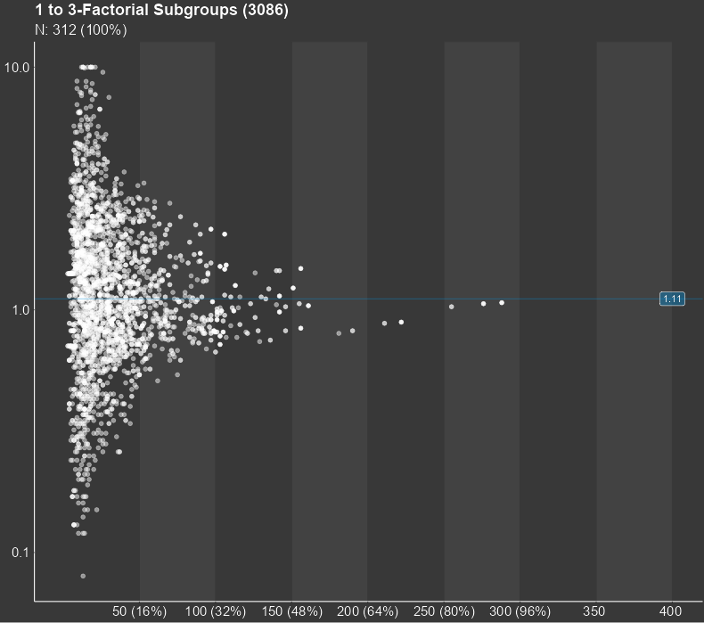

Identifying outcome relevant subgroups has now become as simple as possible! The formerly lengthy and tedious search for the needle in a haystack is replaced by a single, comprehensive and coherent presentation.

The central result of a subgroup screening is a diagram, in which each dot stands for a subgroup. The diagram can show thousands of them. The position of the dot in the diagram is determined by the sample size of the subgroup and the statistical measure of the treatment effect in the respective subgroup. The sample size is shown on the horizontal axis while the treatment effect is displayed on the vertical axis. Furthermore, the diagram shows the line of the overall study results. For small subgroups, which are found on the left side of the plot, larger random deviations from the mean study effect are expected, while the deviation from the study mean for larger subgroups tends to be smaller. Therefore, the dots in the figure are expected to form a funnel for studies with no conspicuous subgroup effects. Any deviations from this funnel shape may hint towards conspicuous subgroups.

## 2. Package Functions

The subscreen package consists of three major functions: `subscreencalc`, `subscreenvi` and `subscreenshow`.
The first function generates an object of class `SubScreenResult`, which is required for the shiny application.
The second function performs a variable importance calculation via random forests. This calculation is optional and will unlock the *Variable importance*-tab in the Subgroup Explorer. 
The third function starts the shiny application Subgroup Explorer. In the recent version of the app, subscreenshow can be accessed without data. In this case, demo data can be selected in the ‘upload data’-tab. To upload own data, either the SubScreenResult object is called in subscreenshow or in the Upload Page the SubScreenResult object is uploaded. In the next sections, all three functions are explained in more detail.

### 2.1 `subscreencalc` Input

The function `subscreencalc` returns a list object of class `SubScreenResult`. This list object contains all subgroup information required in the shiny application. All function parameters are explained in detail in the subsections of this chapter.The following table gives an overview of all parameters which can be adjusted:
<pre>
<b>data               </b> data frame with study data
<b>eval_function      </b> name of the evaluation function for data analysis
<b>subjectid          </b> character of variable name in data that contains the subject identifier, defaults to 'subjid'
<b>factors            </b> character vector containing the names of variables that define the subgroups (required)
<b>max_comb           </b> maximum number of factor combination levels to define subgroups, defaults to 3
<b>nkernel            </b> number of kernels for parallelization (defaults to 1)
<b>par_functions      </b> character vector of names of functions used in eval_function to be exported
                      to cluster (needed only if nkernel > 1)
<b>verbose            </b> logical value to switch on/off output of computational information (defaults to TRUE)
<b>factorial          </b> logical value to switch on/off calculation of factorial contexts (defaults to FALSE)
<b>use_complement     </b> logical value to switch on/off calculation of complement subgroups (defaults to FALSE)
</pre>

#### 2.1.1. data

The input data frame should have one row per subject/patient/observation.
The following columns are required:
<ol>
  <li> treatment/group/reference variable (only if comparison will be performed) </li>
  <li> subgroup factors, i.e. categorized baseline/demographic variables </li>
  <li> variable(s) needed to derive the endpoint/outcome/target variable(s) </li>
</ol>

For example, the data set could include the following columns from the example data set:

<table>
  <tr>
    <th> id &nbsp;    </th> 
    <th> trt &nbsp;        </th> 
    <th> sex &nbsp;         </th> 
    <th> ageg &nbsp;        </th> 
    <th> albuming &nbsp;        </th> 
    <th> cholg &nbsp;         </th> 
    <th> event.pfs &nbsp;        </th>
    <th> timepfs &nbsp;         </th>
  </tr>
  <tr>
    <th> 1 </th> 
    <th> 1 </th> 
    <th> f </th> 
    <th> high </th> 
    <th> Low </th> 
    <th> Low </th> 
    <th> 1 </th>
    <th> 3029 </th>
  </tr>
  <tr>
    <th> 2 </th> 
    <th> 1 </th> 
    <th> f </th> 
    <th> High </th> 
    <th> High </th> 
    <th> Low </th> 
    <th> 1 </th>
    <th> 391 </th>
  </tr>
  <tr>
    <th> 3 </th> 
    <th> 1 </th> 
    <th> m </th> 
    <th> Low </th> 
    <th> High </th> 
    <th> Low </th> 
    <th> 0 </th>
    <th> 299 </th>
  </tr>
  <tr>
    <th> ... </th> 
    <th> ... </th> 
    <th> ... </th> 
    <th> ... </th> 
    <th> ... </th> 
    <th> ... </th> 
    <th> ... </th>
    <th> ... </th>
  </tr>
</table>
where sex, ageg, albuming and cholg are the categorized factor variables and event.pfs and timepfs are the variables used to derive the endpoint via the eval_function (in this example the hazard ratio).

#### 2.1.2. eval_function

The input function eval_function() needs to be defined by the user.
This function calculates the endpoint(s) for each subgroup, e.g. number, rate, mean, odds ratio, hazard ratio, confidence limit, p-value, ...
The results have to be returned as a numerical vector. Each element of the vector represents an endpoint (outcome/treatment effect/result).

In our example, we calculate the hazard ratio for progression free survival:
<pre>
hazardratio <- function(D) {

 HRpfs <- tryCatch(exp(coxph(Surv(D$timepfs, D$event.pfs) ~ D$trt )$coefficients[[1]]),
  warning=function(w) {NA})
 HRpfs <- 1/HRpfs
 HR.pfs <- round(HRpfs, 2)
 HR.pfs[HR.pfs > 10]      <- 10
 HR.pfs[HR.pfs < 0.00001] <- 0.00001
 data.frame( HR.pfs)
}
</pre>
which will add a target variable column named `HR.pfs`.

#### 2.1.3. factors

The parameter `factors` requires a vector containing the names of all variables that define the subgroups. In the example above `factors = c('sex','ageg','phosg','albuming',...)`.

#### 2.1.4. max_comb

This parameter determines the maximum number of factor combination levels to define subgroups.
The default is 3. All combinations between 1 and max_comb will be calculated automatically. With `max_comb = 3` a subgroup could be defined for example as male participant with low age and high albumin values. A high value of max_comb could lead to small or empty combinations of subgroups, which are hard to interpret. So, values of higher than 5 are not recommended. 
If the maximum number of combination is bigger than the number of factors, then the number of factors is used as value for max_comb. In this case a note will be returned.

#### 2.1.5. nkernel

To reduce the calculation time, the parameter nkernel can be increased. 
To use multiple kernels the package parallel needs to be installed. If nkernel > 1 is used, please make sure to use the parameter `par_functions` for all functions within the eval function (see next chapter).

#### 2.1.6. par_functions

This parameter is only required when multiple kernels are used.
It requires the name(s) of functions used in eval_function to be exported to the cluster. In the example, the hazardratio function (see 2.1.2)
uses the functions `coxph` and `Surv`from the survival package. Therefore these functions need to be specified in the parameter `par_functions = c('coxph','Surv')`.
Otherwise an error appears: Error in checkForRemoteErrors(val) :
4 nodes produced errors; first error: could not find function 'coxph'.

#### 2.1.7. verbose

A text of the computational information can be returned with `verbose = TRUE`. Otherwise verbose should be set to FALSE.
The returned text gives information about the start and end time of calculation as well the calculation time of the several steps within the function. Furthermore, the number of subjects, number of subgroup factors, and number of subgroups are returned.

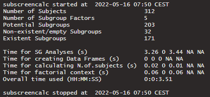

#### 2.1.8. factorial

If (factorial=TRUE) the calculation of factorial contexts is performed, which is required for the ASMUS-tab (see chapter 3.5). The calculation time of subscreencalc increases if the parameter factorial is set to TRUE. A factorial context is defined as the combination of all factor levels of a given subgroup. As an example, for a subgroup with three factor combination sex: f, ageg: High and cholg: Low (all factor variables with 2 levels) the factorial context includes eight subgroups. The concept of factorial contexts will be explained in more detail in <a href='#chap351'> chapter 3.5.1</a>.

#### 2.1.9. use_complement

To activate the complement-calculation of a subgroup the parameter use_complement has to be set to TRUE. 
Since the complement of subgroups with more than one factor level is not necessarily a subgroup as well, the calculation of the complement needs to be activated, if the complements are to be included. 

### 2.2 `subscreencalc` Output

The calculation performed via subscreencalc returns a list object of class `SubScreenResult`.
The following list entries are generated in subscreencalc: sge, max_comb, min_comb, subjectid, factors, results_total.

The main result data set is saved in the sge (short for Subgroup Explorer) entry. This can, for example, have the following structure:
<table>
  <tr>
    <th> SGID &nbsp;    </th> 
    <th> nfactors &nbsp;        </th> 
    <th> HR.pfs &nbsp;         </th> 
    <th> N.of.subjects &nbsp;        </th> 
    <th> sex &nbsp;        </th> 
    <th> ageg &nbsp;        </th> 
    <th> cholg &nbsp;         </th> 
    <th> albuming &nbsp;        </th>
  </tr>
  <tr>
    <th> 1 </th> 
    <th> 1 </th> 
    <th> 1.06 </th> 
    <th> 36 </th> 
    <th> m </th> 
    <th> Not used  </th> 
    <th> Not used  </th> 
    <th> Not used  </th>
  </tr>
  <tr>
    <th> 2 </th> 
    <th> 1 </th> 
    <th> 2.45 </th> 
    <th> 276 </th> 
    <th> f </th> 
    <th> Not used  </th> 
    <th> Not used  </th> 
    <th> Not used  </th>
  </tr>
  <tr>
    <th> 3 </th> 
    <th> 1 </th> 
    <th> 0.89  </th> 
    <th> 101 </th> 
    <th> Not used </th> 
    <th> High </th> 
    <th> Not used  </th> 
    <th> Not used  used </th>
  </tr>
  <tr>
    <th> ... </th> 
    <th> ... </th> 
    <th> ... </th> 
    <th> ... </th> 
    <th> ... </th> 
    <th> ... </th> 
    <th> ... </th> 
    <th> ... </th>
  </tr>
</table>
where every subgroup gets its own subgroup id (column SGID). Also, the number of factor levels in this subgroup is shown in the column nfactors. If a factor variable is not used in the subgroup definition, the specific column entry is coded with 'Not used'.
If the factorial context calculation is activated, a column FCID_all is generated in addition, where subgroups related to the same context are condensed.
Since for every target variable the factorial context is checked for completeness and pseudo completeness, three columns for every target variable are created and saved in results$sge. In the example of hazard ratio of progression free survival (HR.pfs), the columns FCID_complete_HR.pfs, FCID_incomplete_HR.pfs and FCID_pseudo_HR.pfs are generated. If the parameter use_complement is set to TRUE, the column Complement_HR.pfs is also available in the results data set.

The other list entries (max_comb, min_comb, subjectid, treat, and factors) include the parameter values given in the function call. 

The list entry results_total includes the overall results of all subjects. So in the example above, we get the entry results$results_total:

  <table>
    <tr>
      <th> HR.pfs </th>
      <th> N.of.subjects </th>
    </tr>
    <tr>
      <th> 1.11 </th>
      <th> 312 </th>
    </tr>
  </table>

The SubScreenResult object returned by subsreencalc is used as input for subscreenshow (see <a href='#chap23'>chapter 2.3.</a>)

### 2.3 `subscreenvi`

The function subscreenvi performs a variable importance calculation via random forests using the package ranger. The values returned describe the variability of variable importance between treatments. High variability between treatments implies that a subgroup might be more relevant, because the treatment seems to have an influence on how important the variable is for modelling. Low variability implies less relevance as the subgroup is equally important in all treatments.

The following function parameters can be adjusted:
<pre>
<b>data               </b> data frame containing the dependent and independent variables.
<b>y                  </b> name of the column in data that contains the dependent variable.
<b>cens               </b> name of the column in data that contains the censoring variable,
                      if y is an event time (default=NULL).
<b>trt                </b> name of the column in data that contains the treatment variable (default=NULL).
<b>x                  </b> vector that contains the names of the columns in data with the independent
                      variables (default=NULL, i.e. all remaining variables)
</pre>

### 2.3 `subscreenshow`

The function subscreenshow starts the Subgroup Explorer application. The following function parameters can be adjusted:
<pre>
<b>scresults                     </b> SubScreenResult object with results from a subscreencalc call
<b>variable_importance           </b> variable importance object calculated via subscreenvi to unlock 
                                  'variable importance'-tab in the app
<b>host                          </b> host name or IP address for shiny display
<b>port                          </b> port number for shiny display
<b>NiceNumbers                   </b> list of numbers used for a 'nice' scale
<b>windowTitle                   </b> title which is shown for the browser tab
<b>graphSubtitle                 </b> subtitle for explorer graph
<b>favour_label_verum_name       </b> verum name for label use in explorer graph
<b>favour_label_comparator_name  </b> comparator name for label use in explorer graph

</pre>

None of the parameter is required to start the app. 
By entering subscreenshow() to the R console, the app starts on the upload screen.
The app itself will be explained in more detailed version in <a href='#chap3'>chapter 3</a>.

## 3. Subgroup Explorer

To start the subgroup screening via the Subgroup Explorer application, the subscreenshow-function is used (see also previous subchapter 2.3).
The application itself consists of five main tabs: Upload, Explorer, Comparer, Mosaic and ASMUS (Automatic/Advanced Screening of one- or Multi-factorial Subgroups). Each tab will be explained in more detail in the next subchapters.

#### 3.1 Upload

If the data parameter scresults in subscreenshow(scresults = NULL) is null or not specified, the app starts on the upload page.
On the upload page a demo data set or a already saved SubScreenResult object (.RData file) can be selected. If a saved result data set should be loaded, the file can selected via the 'Browse...'-button and the 'Upload data'-button.
For the demo data set the 'demo data' box has to be checked and submitted via the 'Use demo data'-button.
After a data set is selected, the data set information and some checks appear on the right side of the screen. After clicking the 'Upload data'-button all other tabs are unlocked and the Explorer-tab appears.

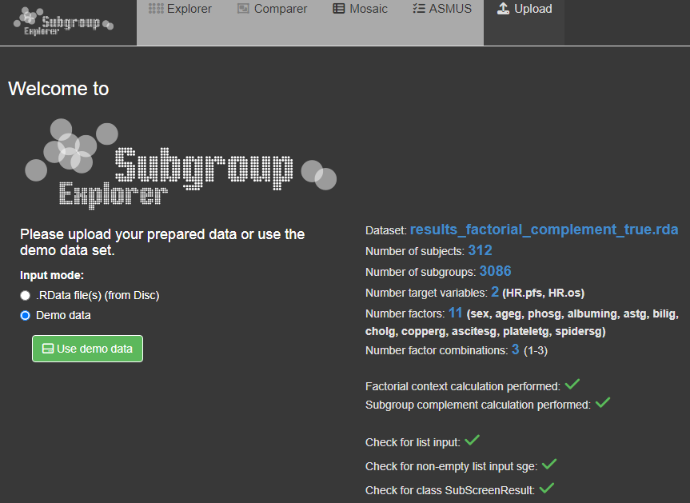

If the SubScreenResult object is already entered via the 'scresults' parameter in subscreenshow, the app starts directly on the Explorer page. In this case a third input mode called 'Uploaded data via function call' appears on the upload page. Since it is possible to use different data sets in the same session, you can use this option the re-upload the data set used in the original function call or just to see the data set information.

Since the factorial context calculation changed due to recent versions, the check 
for 'context calculation performed' also includes a check for the newest package version. 
For older versions features like the ASMUS-tab are no longer supported.

#### 3.2 Explorer

The Explorer-tab is the main part of the Subgroup Explorer. The explanation will be divided into four parts (diagram, lists, interaction plot and options). 

##### 3.2.1 Diagram

The central part of the Subgroup Explorer is the diagram in the middle, in which each single dot stands for a subgroup. The diagram may show thousands of them. The position of the dot in the diagram is determined by the sample size of the subgroup (displayed on the horizontal axis) and the statistical measure of the treatment effect (vertical axis) in that subgroup. Furthermore, the diagram shows the line of the overall study results. For small subgroups, which are found on the left side of the plot, larger random deviations from the mean study effect are expected, while for larger subgroups on the right side, only small deviations from the study mean can be expected to be chance findings. So, for a study with no conspicuous subgroup effects, the dots in the figure are expected to form a kind of funnel. Any deviations from this funnel shape hint to conspicuous subgroups.
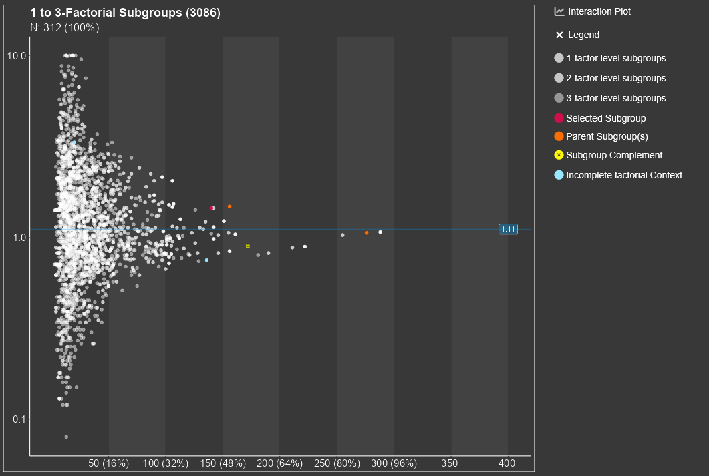

It is important to note that the subgroup screening does not only consider subgroups, which are defined by one single factor, e.g., sex or age-group. The strength of the Subgroup Explorer is that it considers combinations, e.g., 'old' men from Europe or 'young' Asian women. It is possible to analyze all combinations of two factors, three factors, four factors, etc. Typically it make sense to limit this to a maximum of five factors, since combinations of more than five factors define subgroups which are often empty, extremely small in size, or difficult to interpret.

By clicking on a single dot, a subgroup is selected and appears in red. If multiple points are close to each other, a small area around the mouse click is detected and a list of selected subgroups appears. In here one specific subgroup can be selected and apperas in red. For all points an information box can be shown by using mouse hover.

By selecting a subgroup several lists, which include more information about the selected subgroup, appear below the plot.

An interaction plot appears on the right side of the main plot, if a subgroup has a complete (or pseudo-complete) factorial context.
For more details about the concept of a factorial context see chapter 3.5.1. 

Several options for the appearance of the diagram are available and explained in chapter 3.2.4. 

##### 3.2.2 Lists

By clicking on a dot, at the bottom a table will be displayed under the tab called 'Selected Subgroup' listing the selected subgroup. The second tab, called 'Filtered Subgroups', lists all subgroups which are chosen by the drop-down combo-box filtered subgroups in the menu on the left side of the graph. 
Under the tab 'Parent subgroups' the list of all subgroups with one number of factor combination less than the selected subgroup appear. For example if the subgroup with 2 subgroup defining factors ageg: Low and phosg: Low, is selected, the parent subgroups are the two 1-factorial subgroups ageg:Low and phosg:Low.
This allows the comparison with the parent subgroup as a reference.
The Factorial Context and the subgroup complement for selected subgroups are displayed as well in seperated tabs.

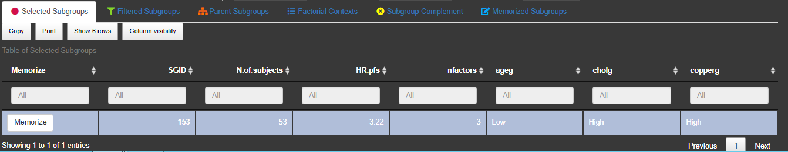

To save/memorize a subgroup the 'Memorize'-button in the table of the 'Selected Subgroups'-tab can be used. All memorized subgroups appear in green in the Subgroup Explorer graph.
With the switch button above the list of memorized subgroups the label of the memorized subgroups can be in or excluded in the graph.
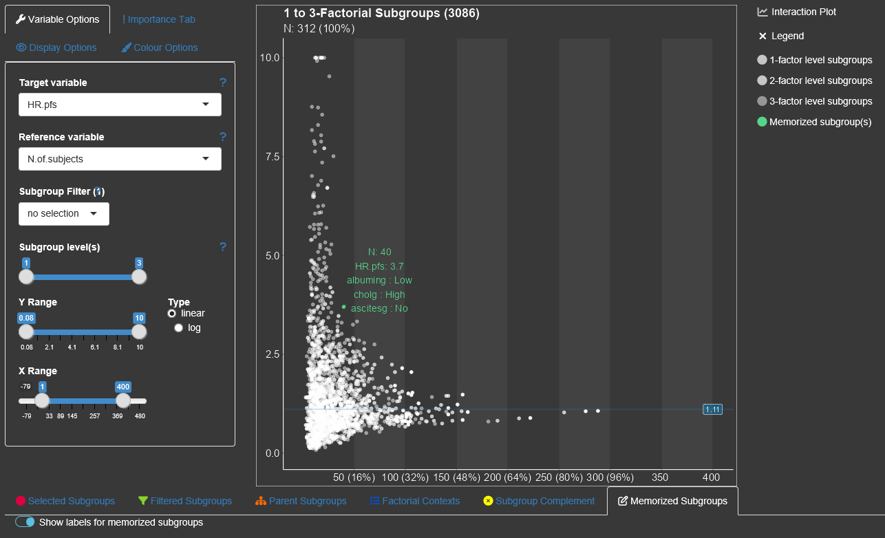
By switching this button to on, the subgroup information for all saved subgroups are drawn into the diagram. Since their might be a space limitation for the information texts for too many subgroups, it could help to increase the axes sizes via 'Display Options'.

##### 3.2.3 Interaction Plot

On the right side of the Explorer tab an intercation plot can be displayed. Per default the plot is collapsed. To use it the user needs to click on 'Interaction Plot' and then select a subgroup.
The interaction can only be displayed for subgroups with an at least pseudo factorial context.If a complete or pseudo complete subgroup is selected, the interaction plot panel opens automatically.
Furthermore is the interaction plot is only available for subgroups with 1 to 3 subgroup defining factors.
The vertical axis of the interaction plot can be synchronized with the diagram (default) or automatically fitted to the values of the context.

##### 3.2.4 Options

There are several display options within the Explorer tab, which are categorized in the four party 'Variable options', 'Importance Tab', 'Display options', Colour options'.

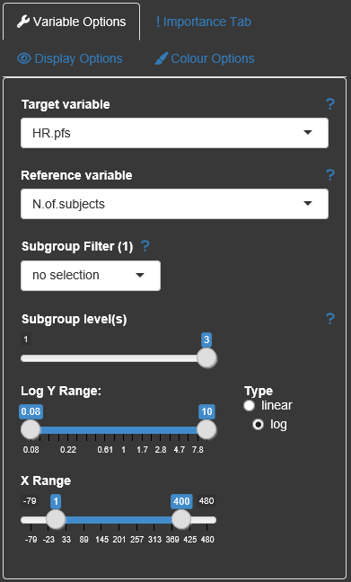

The drop-down combo boxes in the Variable options allow switching between different target variables (y-axis), changing the reference variable (x-axis, in general the number of subjects/observations), or selecting a specific subgroup factor and a corresponding value to be highlighted in the plot ('Subgroup Filter').
Which level of detail with regard to the subgroup factor combinations should be displayed can be chosen via the 'Subgroup level(s)'-slider.
The maximum of this slider can be changed with the parameter `max_comb` in `subscreencalc()`.
The brightness of the gray dots corresponds to the number of factors in the graph. Dots with more factors are brighter than those with less factors.

It is also possible to change the limits of the axes and if possible (only if all values of the target variable are positive) change the y-axis to logarithmic scale.

All options are provided with small help texts, which can be shown by hovering the question mark symbol next to them.

Within the Display options the user can change dot size and click/select radius.
The dot size can be changed to be related to the number of subjects for each subgroup.
The colour brigthness is also adjustable.

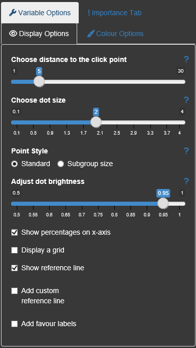

A high amount of colors can be individualized by the user. Beside the dot colors the overall app appearance can be changed to a 'print'-version where the background appears in light gray. 

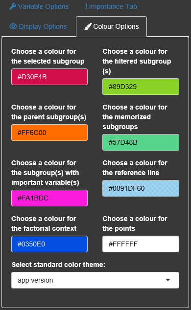

#### 3.3 Comparer

The next tab is similar to the Explorer tab, but allows the quick comparison between two endpoints.
By selecting two target variables two diagrams appear on top of each other. By clicking a subgroup the same subgroup is displayed in both plots. With this approach all conspicuous subgroups in one endpoint can easily be be checked for another endpoint. 
It is also possible to display two target variables directly against each other via the integrated 'Bubble plot'.
The information about the number of subjects is then displayed through the subgroup size. 
Subgroups which are conspicuous in both target variables then shown up in the corners, while unconspicuous subgroups appear in the middle of the graph.

#### 3.4 Mosaic

For an easy visualization about the contingency tables of subgroup sizes and their target variable values, the display of a mosaic plot can be beneficial. The user can select up to 3 factor variables, different target variables for the mosaic display. By using the mouse hover the user can get more information about the subgroups.

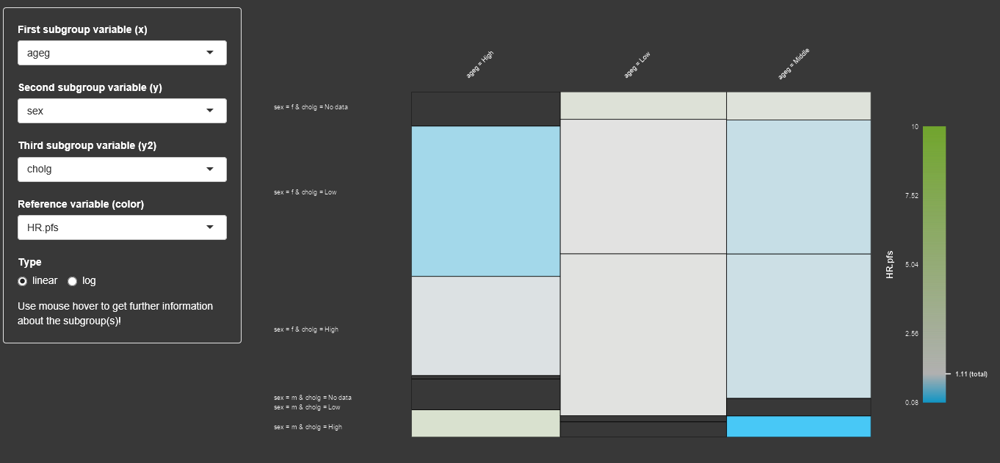

#### 3.5 ASMUS

ASMUS is a feature which guides the user of the Subgroup Explorer through the screening of tens of thousand of subgroups with the aim to find those which are worth pursuing. 
The key of ASMUS is to focus on assessable subgroups only. This reduces the number of subgroups to be considered drastically. 
A fuzzy logic approach is used to select subgroups which have a remarkable treatment effect and which provide reliably information. 
An expert in pharmacology can then decide whether the subgroup defining factors explain the treatment effect reasonably.

The challenge to the user has been to find subgroups which are worth pursuing. 
There was no feature, which guided the user through the process of finding worth pursuing subgroups.
The newly implemented feature ASMUS helps to find all worth pursuing subgroups semi-automatically.
Subgroup analyses are performed to assess the heterogeneity of treatment effects across different groups of patients. There are always subgroups with a treatment effect which differs from the study treatment effect. The fundamental question is whether this observed treatment effect is reproducible or an incidental finding.
This is a matter of the causal influence of the subgroup-defining factors. Theoretical knowledge or experience can provide evidence. Ultimately, only another clinical trial can answer the question.
This is neither a matter of the size of the treatment effect nor the number of patients in the subgroup. Consequently, statistical tests cannot answer the question.
Screening a data set from a clinical trial can only mean to identify subgroups that are worth pursuing in terms of reproducibility.
A subgroup is worth pursuing if and only if
<ul>
<li>
it is assessable,
</li>
<li>
its treatment effect is remarkable,
</li>
<li>
the provided information is reliable 
</li>
<li>
its subgroup-defining factors explain the treatment effect reasonably.
</li>
</ul>

The assessability of a subgroup is indispensable in a subgroup analysis.  
If a subgroup is not assessable, its discovery is not helpful, no matter how big the treatment effect and how big the subgroup is.
Hence, ASMUS considers only those subgroups as worth pursuing which are assessable.
A subgroup is assessable iff it has good references for comparison. 
A subgroup is a good reference for another subgroup if and only if it belongs to the same factorial context. 

 

##### 3.5.1 Factorial Context

For a given subgroup, the factor level combinations of the subgroup defining factor(s) are the factorial context of that subgroup.
A factorial context is complete if 
<ul>
<li>
all its subgroups exist in the data set and they 
</li>
<li>
all have a non-missing treatment-effect.
</li>
</ul>
In all other cases the factorial context is incomplete. If a factorial context is complete, then its subgroups are  assessable.
An incomplete factorial context causes problems, since the treatment effect for a subgroup is not evaluable if we can not see whether its value is driven one specific factor or the  interaction of two or more factors.
To allow a more flexible definition on completeness of factorial contexts, we call/define an incomplete factorial context as pseudo-complete, if the following criterion are met:
<ul>
  <li>
  the factorial context would be complete by removing one single level in one factor
  </li>
  <li>
  we have at least a multi-factorial context (two or more factors)
  </li>
  <li>
  the factor in which the level is removed contains at least 3 levels.
  </li>
</ul>
The following tables provide examples of the different completeness-definitions for 
a factorial context with two factors (sex and age group).
 
Complete:
<table>
    <tr>
      <th>
 	      subgroup
 	    </th>
 	    <th>
 	      sex	
      </th>
      <th>
      age
      </th>
       <th>
        target variable
      </th>
    </tr>
    <tr>
      <th>
 	      1
 	    </th>
 	    <th>
 	      male	
      </th>
      <th>
      <65
      </th>
       <th>
        1.7
      </th>
    </tr>
    <tr>
      <th>
 	      2
 	    </th>
 	    <th>
 	      male	
      </th>
      <th>
      65-75
      </th>
       <th>
        1.3
      </th>
    </tr>
    <tr>
      <th>
 	      3
 	    </th>
 	    <th>
 	      male	
      </th>
      <th>
      =>75
      </th>
       <th>
        2.1
      </th>
    </tr>
    <tr>
      <th>
 	      4
 	    </th>
 	    <th>
 	      female	
      </th>
      <th>
      <65
      </th>
       <th>
        1.5
      </th>
    </tr>
    <tr>
      <th>
 	      5
 	    </th>
 	    <th>
 	      female	
      </th>
      <th>
      65-75
      </th>
       <th>
        1.6
      </th>
    </tr>
    <tr>
      <th>
 	      6
 	    </th>
 	    <th>
 	      female	
      </th>
      <th>
      =>75
      </th>
       <th>
        3.6
      </th>
    </tr>
</table>      
Table 3.5.1.1 Complete factorial context with factors sex and age.

Pseudo-complete:
 	<table>
    <tr>
      <th>
 	      subgroup
 	    </th>
 	    <th>
 	      sex	
      </th>
      <th>
      age	
      </th>
       <th>
        target variable
      </th>
    </tr>
    <tr>
      <th>
 	      1
 	    </th>
 	    <th>
 	      male	
      </th>
      <th>
      <65
      </th>
       <th>
        1.7
      </th>
    </tr>
    <tr>
      <th>
 	      2
 	    </th>
 	    <th>
 	      male	
      </th>
      <th>
      65-75
      </th>
       <th>
        1.3
      </th>
    </tr>
    <tr>
      <th style ='color:grey;'>
 	      <s>3</s>
 	    </th>
 	    <th style ='color:grey;'>
 	      <s>male	</s>
      </th>
      <th style ='color:grey;'>
      <s>=>75</s>
      </th>
       <th style ='color:grey;'>
        <s>2.1</s>
      </th>
    </tr>
    <tr>
      <th>
 	      4
 	    </th>
 	    <th>
 	      female	
      </th>
      <th>
      <65
      </th>
       <th>
        1.5
      </th>
    </tr>
    <tr>
      <th>
 	      5
 	    </th>
 	    <th>
 	      female	
      </th>
      <th>
      65-75
      </th>
       <th>
        1.6
      </th>
    </tr>
    <tr>
      <th style ='color:grey;'>
 	     <s> 6 </s>
 	    </th>
 	    <th style ='color:grey;'>
 	      <s>female	</s>
      </th>
      <th style ='color:grey;'>
      <s>=>75</s>
      </th>
       <th style ='color:red;'>
        <s>NA</s>
      </th>
    </tr>
</table>    
Table 3.5.1.2 Pseudo-complete factorial context with factors sex and age after removing level age >= 75.

Incomplete:
 <table>
    <tr>
      <th>
 	      subgroup
 	    </th>
 	    <th>
 	      sex	
      </th>
      <th>
      age	
      </th>
       <th>
        target variable
      </th>
    </tr>
    <tr>
      <th>
 	      1
 	    </th>
 	    <th>
 	      male	
      </th>
      <th>
      <65
      </th>
       <th>
        1.7
      </th>
    </tr>
    <tr>
      <th>
 	      2
 	    </th>
 	    <th>
 	      male	
      </th>
      <th>
      65-75
      </th>
       <th style ='color:red;'>
        NA
      </th>
    </tr>
    <tr>
      <th>
 	      3
 	    </th>
 	    <th>
 	      male	
      </th>
      <th>
      =>75
      </th>
       <th>
        2.1
      </th>
    </tr>
    <tr>
      <th>
 	      4
 	    </th>
 	    <th>
 	      female	
      </th>
      <th>
      <65
      </th>
       <th>
        1.5
      </th>
    </tr>
    <tr>
      <th>
 	      5
 	    </th>
 	    <th>
 	      female	
      </th>
      <th>
      65-75
      </th>
       <th>
        1.6
      </th>
    </tr>
    <tr>
      <th>
 	      6
 	    </th>
 	    <th>
 	      female	
      </th>
      <th>
      =>75
      </th>
       <th style ='color:red;'>
        NA
      </th>
    </tr>
</table>    
Table 3.5.1.3 Incomplete factorial context with factors sex and age.
 
This question whether a subgroup is remarkable can only be answered for the drug currently under development and in comparison to the study treatment effect. Medical knowledge is needed to answer the question.
Although the size of the treatment effect of a given subgroup does not say anything about the reproducibility, it makes sense to include it into the screening strategy since finding a reproducible but neglectable treatment effect is not useful.
To identify remarkable treatment effects it is difficult to define a crisp cut point between the remarkable and the non-remarkable treatment effect.
It is much easier to define two numbers, rem1 and rem2, such that treatment effects 
less than a are truly not remarkable greater than rem2 are truly remarkable
between rem1 and rem2 are remarkable with a certain degree of truth.
ASMUS is based on this fuzzy logic approach utilizing a linear truth-function.
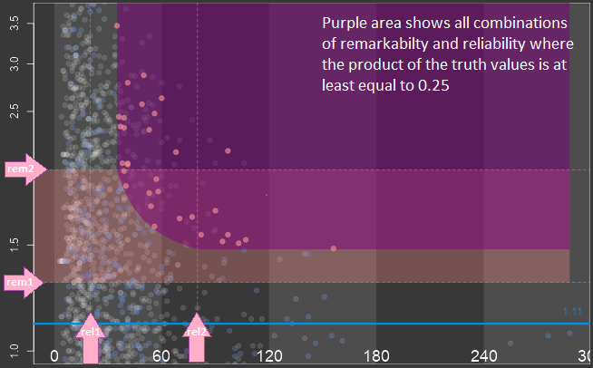
The provided information is reliable when the sizes of the subgroups of a factorial context play an important role, but this is not the only criterion. The relation of the treatment group sizes within the subgroups play role as well.
A big subgroup with drastically imbalanced treatment groups may not considered to provide less reliable information than a smaller subgroup with nearly balanced treatment groups. 
However, ASMUS is based on the size of subgroups only for simplicity reasons.
Although the reliability of information does not say anything about the reproducibility of the treatment effect it makes sense to include it into the screening strategy.
Even if a treatment effect is remarkable and the subgroup-defining factors explain the treatment effect reasonably the subgroup is not worth pursuing because the reliability of the provided information is poor.
Again it is difficult to define a crisp cut point between subgroup sizes sufficiently big to provide reliable information and those which do not.
It is much easier to define two numbers, rel1 and rel2, such that subgroup sizes
less than rel1 are truly too small greater than rel2 are truly big enough
between rel1 and rel2 are big enough with a certain degree of truth.

The truth value for the remarkability of the treatment effect and the truth value for the reliability of the provided information are combined with a logical “and”.
From the many proposal, which can be found in the literature, to calculate a logical “and” in fuzzy logic (minimum, algebraic product, drastic product, etc. ), we selected the algebraic product because it is simple and convex.
The convexity is appreciated because a lower truth-value for the remarkability requires a compensation with a  higher truth-value for the reliability and vice versa.
The central question is when do the subgroup-defining factors explain the treatment effect reasonably.
It can only be answered by experts in pharmacology.

So in ASMUS, the user selects whether the assessability is based on the 
complete factorial context only or complete and pseudo-complete factorial contexts.
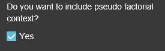
The user also specifies the numbers a and b for the remarkability and the reliability criterion.
For a given subgroup it is determined if it is assessable.  
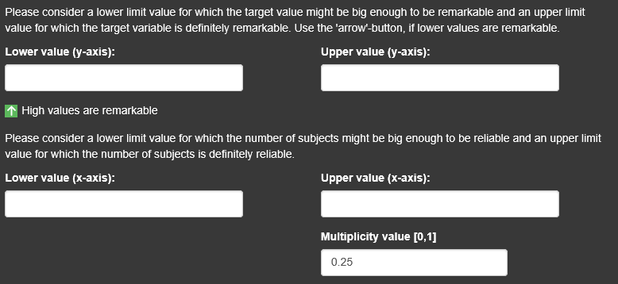
The truth values for the treatment effect and the size of the subgroup
are calculated and multiplied (algebraic product for a fuzzy logical “and”).
If the subgroup is assessable and the product of the truth values exceeds a user defined threshold the subgroup is proposed to be evaluated whether its subgroup defining factors explain the treatment effect reasonably.
The direction of remarkability can be changed via tickbox.
The multiplicity value requires a value between 0 and 1 and influence the steepness and shape of the curve.
When all settings have been made, the number of subgroups which are remarkable and reliable regarding the selection are displayed and the 'Continue'-button appears in green.

After clicking continue, the second page of ASMUS opens where the remarkable and reliable subgroups can be analysed in more detail.
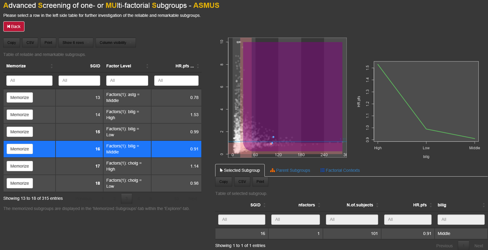

