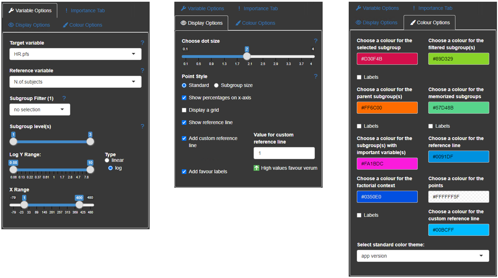

# Subscreen 

<!-- badges: start -->

<!-- badges: end -->

***subscreen*** (***sub***group ***screen***ing) package has been developed to systematically analyze data, e.g., from clinical trials, for subgroup effects and visualize the outcome for all evaluated subgroups simultaneously.
The visualization is done by a shiny application called Subgroup Explorer. Typically, shiny applications are hosted on a dedicated shiny server, but due to the sensitivity of patient data in clinical trials, which are usually protected by informed consents, the upload of this data to an external server is prohibited. Therefore, we provide our tool as a stand-alone application that can be launched from any local machine on which the data is stored. 

**Table of contents**

  <ul>
    <li> <a href='#chap1'> 1. Getting Started </a> </li>
    <li> <a href='#chap2'> 2. Package Functions </a>
      <ul> 
        <li> <a href='#chap21'> 2.1 `subscreencalc` Input </a>
          <ul>
            <li><a href='#chap211'> 2.1.1 data </a></li>
            <li><a href='#chap212'> 2.1.2 eval_function </a></li>
            <li><a href='#chap213'> 2.1.3 factors </a></li>
            <li><a href='#chap214'> 2.1.4 max_comb </a></li>
            <li><a href='#chap215'> 2.1.5 nkernel </a></li>
            <li><a href='#chap216'> 2.1.6 par_functions </a></li>
            <li><a href='#chap217'> 2.1.7 verbose </a></li>
            <li><a href='#chap218'> 2.1.8 factorial </a></li>
            <li><a href='#chap219'> 2.1.9 use_complement </a></li>
          </ul>
        </li> 
        <li> <a href='#chap22'> 2.2 `subscreencalc` Output </a> </li> 
        <li> <a href='#chap23'> 2.3 `subscreenvi` </a> </li> 
        <li> <a href='#chap24'> 2.4 `subscreenfunnel` </a> </li> 
        <li> <a href='#chap25'> 2.5 `subscreenshow` </a> </li>
      </ul>
    </li>
    <li> <a href='#chap3'> 3. Subgroup Explorer </a>
      <ul> 
        <li> <a href='#chap31'> 3.1 Upload </a> </li>  
        <li> <a href='#chap32'> 3.2 Explorer </a>
          <ul>
            <li> <a href='#chap321'> 3.2.1 Diagram </a> </li>
            <li> <a href='#chap322'> 3.2.2 Lists </a> </li>
            <li> <a href='#chap323'> 3.2.3 Interaction Plot </a> </li>
            <li> <a href='#chap324'> 3.2.4 Options </a> </li>
          </ul>
        </li>  
        <li> <a href='#chap33'> 3.3 Comparer </a> </li>  
        <li> <a href='#chap34'> 3.4 Mosaic </a> </li>  
        <li> <a href='#chap35'> 3.5 ASMUS </a>
          <ul>
            <li> <a href='#chap351'> 3.5.1 Factorial Contexts </a> </li>
            <li> <a href='#chap352'> 3.5.2 Methodology </a> </li>
            <li> <a href='#chap353'> 3.5.3 Application </a> </li>
          </ul>
        </li> 
      </ul> 
    </li>
  </ul>

## 1. Getting Started

Identifying outcome relevant subgroups has now become as simple as possible! The formerly lengthy and tedious search for the needle in a haystack is replaced by a single, comprehensive and coherent presentation.

The central result of a subgroup screening is a diagram, in which each dot stands for a subgroup. The diagram can show thousands of them. The position of the dot in the diagram is determined by the sample size of the subgroup and the statistical measure of the treatment effect in the respective subgroup. The sample size is shown on the horizontal axis while the treatment effect is displayed on the vertical axis. Furthermore, the diagram shows the line of the overall study results. For small subgroups, which are found on the left side of the plot, larger random deviations from the mean study effect are expected, while the deviation from the study mean for larger subgroups tends to be smaller. Therefore, the dots in the figure are expected to form a funnel for studies with no conspicuous subgroup effects. Any deviations from this funnel shape may hint towards conspicuous subgroups.

To get started, the R-package `subscreen` needs to be installed using

    install_github("Bayer-Group/BIC-subscreen")

After installation it is possible to open the app with demo data by using

    library("subscreen")
    subscreenshow()
    
and choosing 'Demo data' as Input mode.

To prepare and use real data, please refer to [chapter 2](#chap2) and [chapter 3](#chap2) where the relevant functions and the app in general are described in more detail.

## 2. Package Functions

The subscreen package consists of four major functions: [`subscreencalc`](#chap21), [`subscreenvi`](#chap23), [`subscreenfunnel`](#chap24) and [`subscreenshow`](#chap25).
The first function generates an object of class `SubScreenResult`, which is required for the shiny application.
The second function performs a variable importance calculation via random forests. This calculation is optional and will unlock the *Variable importance*-tab in the Subgroup Explorer. 
The third function creates a reference funnel based on non-parametric confidence intervals.
The fourth function starts the shiny application Subgroup Explorer. In the current version of the app, subscreenshow can be accessed without data. In this case, demo data can be selected in the ‘upload data’-tab. To upload own data, either the SubScreenResult object is called in subscreenshow or in the Upload Page the SubScreenResult object is uploaded. In the next sections, all three functions are explained in more detail.

### 2.1 `subscreencalc` Input

The function `subscreencalc` returns a list object of class `SubScreenResult`. This list object contains all subgroup information required in the shiny application. All function parameters are explained in detail in the subsections of this chapter.The following table gives an overview of all parameters which can be adjusted:
<pre>
<b> <a href='#chap211'>data</a>               </b> data frame with study data
<b> <a href='#chap212'>eval_function</a>      </b> name of the evaluation function for data analysis
<b> subjectid          </b> character of variable name in data that contains the subject identifier, defaults to 'subjid'
<b> <a href='#chap213'>factors</a>            </b> character vector containing the names of variables that define the subgroups (required)
<b> <a href='#chap214'>max_comb</a>           </b> maximum number of factor combination levels to define subgroups, defaults to 3
<b> <a href='#chap215'>nkernel</a>            </b> number of kernels for parallelization (defaults to 1)
<b> <a href='#chap216'>par_functions</a>      </b> character vector of names of functions used in eval_function to be exported to cluster (needed only if nkernel > 1)
<b> <a href='#chap217'>verbose</a>            </b> logical value to switch on/off output of computational information (defaults to TRUE)
<b> <a href='#chap218'>factorial</a>          </b> logical value to switch on/off calculation of factorial contexts (defaults to FALSE)
<b> <a href='#chap219'>use_complement</a>     </b> logical value to switch on/off calculation of complement subgroups (defaults to FALSE)
</pre>

#### 2.1.1. data

The input data frame should have one row per subject/patient/observation.
The following columns are required:

* treatment/group/reference variable (only if comparison will be performed)
* subgroup factors, i.e. categorized baseline/demographic variables
* variable(s) needed to derive the endpoint/outcome/target variable(s)

For example, the data set could include the following columns from the example data set:

| id | trt  | sex | ageg | albuming | cholg | event.pfs | timepfs |
|:-------:|:-------:|:-------:|:-------:|:-------:|:---------:|:--------:|:------:|
| 1 | 1 | f | high | low | low | 1 | 3029 |
| 2 | 1 | f | high | high | low | 1 |391  |
| 3 | 1 | m | low | high | low | 0 | 299 |
| ... | ... | ... | ... | ... | ... | ... | ... |

where sex, ageg, albuming and cholg are the categorized factor variables and event.pfs and timepfs are the variables used to derive the endpoint via the eval_function (in this example the hazard ratio).

#### 2.1.2. eval_function

The input function eval_function() needs to be defined by the user.
This function calculates the endpoint(s) for each subgroup (e.g. number, rate, mean, odds ratio, hazard ratio, confidence limit, p-value, ...).
The results have to be returned as a numerical vector. Each element of the vector represents an endpoint (outcome/treatment effect/result).

In our example, we calculate the hazard ratio for progression free survival:

    hazardratio <- function(D) {
    
     HRpfs <- tryCatch(exp(coxph(Surv(D$timepfs, D$event.pfs) ~ D$trt )$coefficients[[1]]),
      warning=function(w) {NA})
     HRpfs <- 1/HRpfs
     HR.pfs <- round(HRpfs, 2)
     HR.pfs[HR.pfs > 10]      <- 10
     HR.pfs[HR.pfs < 0.00001] <- 0.00001
     data.frame( HR.pfs)
    }

which will add a target variable column named `HR.pfs`.

#### 2.1.3. factors

The parameter `factors` requires a vector containing the names of all variables that define the subgroups. In the example above `factors = c('sex','ageg','phosg','albuming',...)`.

#### 2.1.4. max_comb

This parameter determines the maximum number of factor combination levels to define subgroups.
The default is 3. All combinations between 1 and max_comb will be calculated automatically. With `max_comb = 3` a subgroup could be defined for example as male participant with low age and high albumin values. A high value of max_comb could lead to small or empty combinations of subgroups, which are hard to interpret. So, values of higher than 5 are not recommended. 
If the maximum number of combination is bigger than the number of factors, then the number of factors is used as value for max_comb. In this case a note will be returned.

#### 2.1.5. nkernel

To reduce the calculation time, the parameter nkernel can be increased. 
To use multiple kernels the package parallel needs to be installed. If nkernel > 1 is used, please make sure to use the parameter `par_functions` for all functions within the eval function (see [next chapter](#chap216)).

#### 2.1.6. par_functions

This parameter is only required when multiple kernels are used.
It requires the name(s) of functions used in eval_function to be exported to the cluster. In the example, the hazardratio function (see [chapter 2.1.2](#chap212)) uses the functions `coxph` and `Surv`from the survival package. Therefore, these functions need to be specified in the parameter `par_functions = c('coxph','Surv')`.
Otherwise an error appears: 
<pre>Error in checkForRemoteErrors(val) : 4 nodes produced errors; first error: could not find function 'coxph'.</pre>

#### 2.1.7. verbose

A text of the computational information can be returned with `verbose = TRUE`. Otherwise, verbose should be set to FALSE.
The returned text gives information about the start and end time of calculation as well the calculation time of the steps within the function. Furthermore, the number of subjects, number of subgroup factors, and number of subgroups are returned.

#### 2.1.8. factorial

If `factorial=TRUE`, the calculation of factorial contexts is performed, which is required for the ASMUS-tab (see [chapter 3.5](#chap35)). The calculation time of subscreencalc increases if the parameter factorial is set to TRUE. A factorial context is defined as the combination of all factor levels of a given subgroup. As an example, for a subgroup with three factor combination sex: f, ageg: High and cholg: Low (all factor variables with 2 levels respectively) the factorial context includes eight subgroups. The concept of factorial contexts will be explained in more detail in [chapter 3.5.1](#chap351).

#### 2.1.9. use_complement

To activate the complement-calculation of a subgroup the parameter use_complement has to be set to TRUE. 
Since the complement of subgroups with more than one factor level is not necessarily a subgroup as well, the calculation of the complement needs to be activated, if the complements are to be included. 

### 2.2 `subscreencalc` Output

The calculation performed via `subscreencalc` returns a list object of class `SubScreenResult`.
The following list entries are generated in subscreencalc: sge, max_comb, min_comb, subjectid, factors, results_total.

The main result data set is saved in the sge (short for Subgroup Explorer) entry. This can, for example, have the following structure:

| SGID | nfactors  | HR.pfs | N.of.subjects | sex | ageg | cholg | albuming |
|:-------:|:-------:|:-------:|:-------:|:-------:|:---------:|:--------:|:------:|
| 1 | 1 | 1.06 | 36 | m | Not used | Not used | Not used |
| 2 | 1 | 2.45 | 276 | f | Not used | Not used |Not used |
| 3 | 1 | 0.89 | 101 | Not used | high | Not used | Not used |
| ... | ... | ... | ... | ... | ... | ... | ... |

where each subgroup gets its own subgroup id (column SGID). Also, the number of factor levels in this subgroup is shown in the column nfactors. If a factor variable is not used in the subgroup definition, the specific column entry is coded with 'Not used'.
If the factorial context calculation is activated, a column FCID_all is generated in addition, where subgroups related to the same context are condensed.
Since for every target variable the factorial context is checked for completeness and pseudo completeness, three columns for every target variable are created and saved in results$sge. In the example of hazard ratio of progression free survival (HR.pfs), the columns `FCID_complete_HR.pfs`, `FCID_incomplete_HR.pfs` and `FCID_pseudo_HR.pfs` are generated. If the parameter use_complement is set to TRUE, the column `Complement_HR.pfs` is also available in the results data set.

The other list entries (max_comb, min_comb, subjectid, treat, and factors) include the parameter values given in the function call. 

The list entry results_total includes the overall results of all subjects. So in the example above, we get the entry results$results_total:

| HR.pfs        | N.of.subjects |
|:-------------:|:-------------:|
| 1.11          | 312           |

The SubScreenResult object returned by subsreencalc is used as input for subscreenshow (see [chapter 2.3](#chap23))

### 2.3 `subscreenvi`

The function `subscreenvi` performs a variable importance calculation via random forests using the package ranger. The values returned describe the variability of variable importance between treatments. High variability between treatments implies that a subgroup might be more relevant, because the treatment seems to have an influence on how important the variable is for modelling. Low variability implies less relevance as the subgroup is equally important in all treatments.

The following function parameters can be adjusted:
<pre>
<b>data               </b> data frame containing the dependent and independent variables.
<b>y                  </b> name of the column in data that contains the dependent variable.
<b>cens               </b> name of the column in data that contains the censoring variable, if y is an event time (default=NULL).
<b>trt                </b> name of the column in data that contains the treatment variable (default=NULL).
<b>x                  </b> vector that contains the names of the columns in data with the independent variables (default=NULL, i.e. all remaining variables)
</pre>

Using the `subscreenvi`-function is optional. It is not required to be able to start the app.

### 2.4 `subscreenfunnel`

The function `subscreenfunnel` adds a `funnel_quantiles` data frame to the `SubScreenResult` object created by [`subscreencalc`](#chap21). It enables the user to add a reference funnel in the main diagram of the app.
The funnel can help in the search for conspicuous subgroups as it gives a reference for the area in the plot where `(1-alpha)*100`% of the subgroups are supposed to be. 

The algorithm used for the calculates the funnel shape separately for each `alpha` and factor combination level.
It uses the following steps:

* create `nperm` permutations of subgroups for each of `n_support_points` different subgroup sizes ranging from `min_start` to the total number of subjects in equidistant steps
* perform subgroup analysis for each permutation
* calculate the (`alpha`/2)- and (1-`alpha`/2)-quantile for each of the `n_support_points` subgroup sizes

The following function parameters can be adjusted:
<pre>
<b>data               </b> data frame with study data
<b>H                  </b> results file from subscreencalc
<b>eval_function      </b> eval function used in subscreencalc
<b>min_start          </b> integer value for minimal subgroup size value for permutation
<b>n_support_points   </b> integer value for number of supportive points
<b>nperm              </b> integer value for number of permutations
<b>alpha              </b> numerical vector
<b>stratified         </b> logical value (TRUE/FALSE) for stratification
<b>treat              </b> character value of treatment variable name
<b>endpoints          </b> character vector of endpoints
<b>verbose            </b> logical value to switch on/off output of computational information (defaults to TRUE)
<b>nkernel            </b> integer value for number of kernel used
</pre>

Using the `subscreenfunnel`-function is optional. It is not required to be able to start the app.
The funnel is currently only available for treatment comparisons of exactly two treatments.

### 2.5 `subscreenshow`

The function `subscreenshow` starts the Subgroup Explorer application. The following function parameters can be adjusted:

<pre>
<b>scresults                     </b> SubScreenResult object with results from a subscreencalc call
<b>variable_importance           </b> variable importance object calculated via subscreenvi to unlock 'variable importance'-tab in the app
<b>host                          </b> host name or IP address for shiny display
<b>port                          </b> port number for shiny display
<b>NiceNumbers                   </b> list of numbers used for a 'nice' scale
<b>windowTitle                   </b> title which is shown for the browser tab
<b>graphSubtitle                 </b> subtitle for explorer graph
<b>favour_label_verum_name       </b> verum name for label use in explorer graph
<b>favour_label_comparator_name  </b> comparator name for label use in explorer graph
<b>showTables                    </b> logical for display tables in 'Explorer tab' (defaults to FALSE)
<b>reference_line_at_start       </b> logical for reference line appearance at start (defaults to FALSE)
<b>reference_value               </b> numeric value of horizontal reference line (defaults to 1)
<b>favour_label_at_start         </b> logical for favour labels appearance at start (defaults to FALSE)
<b>favour_direction              </b> logical for favour label direction, where TRUE means favour_label_verum_name is on top (defaults to TRUE)
<b>subgroup_levels_at_start      </b> integer value for subgroup level slider at start
<b>yaxis_type                    </b> character ('lin' vs. 'log') for y-axis type (defaults to 'lin')
<b>add_funnel_at_start           </b> logical for funnel appearance at start (defaults to FALSE)
</pre>

None of the parameters are required to start the app. 
By entering `subscreenshow()` to the R console, the app starts on the upload screen.
The app itself will be explained in more detailed version in [chapter 3](#chap3).

## 3. Subgroup Explorer

To start the subgroup screening via the Subgroup Explorer application, the `subscreenshow`-function is used (see also [chapter 2.3](#chap23)).
The application itself consists of five main tabs: [Upload](#chap31), [Explorer](#chap32), [Comparer](#chap33), [Mosaic](#chap34) and [ASMUS](#chap35) (Automatic/Advanced Screening of one- or Multi-factorial Subgroups). Each tab will be explained in more detail in the next subchapters.

#### 3.1 Upload

If the data parameter `scresults` in `subscreenshow(scresults = NULL)` is set to `NULL` or not specified, the app starts on the upload page.
On the upload page a demo data set or an already saved `SubScreenResult` object (.RData file) can be selected. If a saved result data set should be loaded, the file can be selected via the 'Browse...'-button and the 'Upload data'-button.
For the demo data set the 'demo data' box has to be checked and submitted via the 'Use demo data'-button.
After a data set is selected, the data set information and some checks appear on the right side of the screen.
Factors can then be manually de- and re-selected using the drop-down menu.
After clicking the 'Upload data'-button all other tabs are unlocked and the Explorer-tab appears.

If the `SubScreenResult` object is already entered via the `scresults` parameter in `subscreenshow`, the app starts directly on the Explorer page. In this case a third input mode called 'Uploaded data via function call' appears on the upload page. Since it is possible to use different data sets in the same session, you can use this option the re-upload the data set used in the original function call or just to see the data set information.

Since the factorial context calculation changed in recent versions, the check 
for 'context calculation performed' also includes a check for the newest package version. 
For older versions, features like the ASMUS-tab are no longer supported.

#### 3.2 Explorer

The Explorer-tab is the main part of the Subgroup Explorer. The following subchapters will explain the four parts within the Explorer-tab: [diagram](#chap321), [tables](#chap322), [interaction plot](#chap323) and [options](#chap324). 

##### 3.2.1 Diagram

The central part of the Subgroup Explorer is the diagram in the middle, in which each single dot stands for a subgroup. The diagram may show thousands of them. The position of the dot in the diagram is determined by the sample size of the subgroup (displayed on the horizontal axis) and the statistical measure of the treatment effect (vertical axis) in that subgroup. Furthermore, the diagram shows the line of the overall study results. For small subgroups, which are found on the left side of the plot, larger random deviations from the mean study effect are expected, while for larger subgroups on the right side, only small deviations from the study mean can be expected to be chance findings. So, for a study with no conspicuous subgroup effects, the dots in the figure are expected to form a kind of funnel. Any deviations from this funnel shape hint to conspicuous subgroups.

 

It is important to note that the subgroup screening does not only consider subgroups, which are defined by one single factor, e.g., sex or age-group. The strength of the Subgroup Explorer is that it considers combinations, e.g., 'old' men from Europe or 'young' Asian women. It is possible to analyze all combinations of two factors, three factors, four factors, etc. Usually, it make sense to limit this to a maximum of five factors, since combinations of more than five factors define subgroups which are often empty, extremely small in size, or difficult to interpret.

By clicking on a single dot, a subgroup is selected and appears in red. If multiple points are close to each other, a small area around the mouse click is detected and a list of selected subgroups appears. One specific subgroup can then be selected from this list. For all points an information box can be shown by using mouse hover or the labels-option can be used to easily see which subgroups are selected (see [chapter 3.2.4](#chap324)). 

A panel containing an interaction plot can be opened using the button on top of the diagram, if a subgroup has a complete (or pseudo-complete) factorial context. For more details about the concept of a factorial context see [chapter 3.5.1](#chap351). 

Several options for the appearance of the diagram are available and explained in [chapter 3.2.4](#chap324). 

##### 3.2.2 Tables

If the option `showTables=TRUE` is used while opening the app (see [subscreenshow()](#chap25)) six tabs containing subgroup listings can be shown.

By clicking on a dot, a table that gives more information on the selected subgroup will be displayed below the diagram in the tab called 'Selected Subgroup'. 
The second tab, called 'Filtered Subgroups', lists all subgroups which are chosen by the drop-down combo-box filtered subgroups in the menu on the left side of the graph. 
Under the tab 'Parent subgroups' the list of all subgroups with one number of factor combination less than the selected subgroup appear. For example, if the subgroup with two subgroup defining factors `ageg='Low'` and `phosg='Low'` is selected, the parent subgroups are the two one-factorial subgroups `ageg='Low'` and `phosg='Low'`. This allows the comparison with the parent subgroup as a reference.
The Factorial Context and the subgroup complement for selected subgroups are displayed as well in separate tabs.
To save/memorize a subgroup the 'Memorize'-button in the table of the 'Selected Subgroups'-tab can be used. All memorized subgroups appear in green in the Subgroup Explorer graph and are listed in the 'Memorized Subgroups' tab.

##### 3.2.3 Interaction Plot

The interaction plot can be displayed using the 'interaction plot'-button on top of the diagram. Per default the plot is collapsed. A subgroup with an at least pseudo factorial context needs to be selected. Furthermore, the interaction plot is only available for subgroups with up to 3 subgroup defining factors.
The vertical axis of the interaction plot can be synchronized with the diagram (default) or automatically fitted to the values of the context.

##### 3.2.4 Options

There are multiple display options available within the Explorer tab, which are categorized into four tabs: '*Variable Options*', '*Importance Tab*', '*Display Options*' and '*Colour Options*'.
Small help texts are provided for all options within the tabs and can be shown by hovering the question mark symbol next to them.

The drop-down combo boxes in the '*Variable Options*'-tab allow switching between different 'Target variables' (y-axis), changing the 'Reference variable' (x-axis, usually the number of subjects/observations), as well as selecting a specific subgroup factor and a corresponding value to be highlighted in the plot ('Subgroup Filter').

Using the 'Subgroup level(s)'-slider, the level of detail regarding the displayed subgroup factor combinations can be adjusted.
The maximum of this slider is determined by the parameter [`max_comb`](#chap214) in [`subscreencalc()`](#chap21).
The brightness of the dots in the diagram corresponds to the number of factors of the respective subgroup. Dots with more factors are displayed with a brighter colour than those with fewer factors.

It is also possible to change the limits of the axes and, if possible, change the y-axis to a logarithmic scale (only if all values of the target variable are positive).

Further information on the '*Importance Tab*' can be found in [chapter 2.3](#chap23).

Within the '*Display Options*'-tab the user can change the dot size.
The dot size can either be chosen on a scale or selected to correspond to the number of subjects for each subgroup.

By checking or un-checking the boxes, the user can choose to 'Show percentages on x-axis' next to the number displayed, 'Display a grid' on the diagram for better readability, 'Show reference line' of the overall value, 'Add custom reference line' and choose its value, as well as 'Add favour labels' and choose which direction (up or down) favours verum, i.e. whether higher or lower values correspond to a better value in the verum group.

The '*Colour Options*'-tab allows for changes in the colour design of the app. The overall theme can be changed to a 'print'-version where the background appears in light gray instead of the usual dark grey. The colours of the selected subgroup(s), filtered subgroup(s), parent subgroup(s), memorized subgroup(s), subgroup(s) with important variable(s), as well as of the reference line, custom reference line, of the dots and the factorial context, can be selected individually. Additionally, it is possible to add labels for selected subgroup(s), parent subgroup(s), memorized subgroup(s) and the factorial context that appear in the plot when a subgroup has been selected.

#### 3.3 Comparer

The 'Comparer'-tab displays similar diagrams as the 'Explorer'-tab, but allows the quick comparison between two endpoints.
Two target variables can be selected. These are then displayed in two diagrams on top of each other. Subgroups that are selected in one plot will be displayed in both plots. With this approach all conspicuous subgroups in one endpoint can easily be be checked for another endpoint. 

It is also possible to directly compare the values of the two target variables via the integrated 'Bubble plot'.
The subgroups are displayed as 'bubbles' (dots of different sizes) in a type of scatter plot. X- and y-axis represent the two target variables. The size of each bubble corresponds to the number of subjects in the displayed subgroup. Subgroups that are conspicuous in both target variables then shown up in the corners, while non-conspicuous subgroups appear in the middle of the graph.

#### 3.4 Mosaic

To easily visualize the contingency tables of subgroup sizes and their target variable values, the display of a mosaic plot can be beneficial. In the 'Mosaic'-tab, the user can select up to 3 factor variables and choose the target variable ('Reference Variable') to be displayed in the mosaic plot. The size of the tiles relate to the relative frequency of each selected subgroup in the population. The colour of each tile represents the value of the target variable with a legend of the scale shown on the right side of the plot. More detailed information on each tile and the subgroup it represents can be shown by hovering over the respective part of the plot.

#### 3.5 ASMUS

ASMUS is a feature which guides the user of the Subgroup Explorer through the screening of tens of thousand of subgroups with the aim to find those which are worth pursuing. 
The key of ASMUS is to focus on assessable subgroups only. This reduces the number of subgroups to be considered drastically. 
A fuzzy logic approach is used to select subgroups which have a remarkable treatment effect and which provide reliable information. 
An expert in pharmacology can then decide whether the subgroup defining factors explain the treatment effect reasonably.

Previously, the challenge to the user was to find subgroups which are worth pursuing. 
There was no feature, which guided the user through the process of finding such subgroups.
The newly implemented feature ASMUS helps to find all subgroups worth pursuing in a semi-automatic way.
Subgroup analyses are performed to assess the heterogeneity of treatment effects across different groups of patients. There are always subgroups with a treatment effect which differs from the study treatment effect. The fundamental question is whether this observed difference is reproducible or an incidental finding.
This is a matter of the causal influence of the subgroup-defining factors. Theoretical knowledge or experience can provide evidence. Ultimately, only another clinical trial can answer the question.
This is neither a matter of the size of the treatment effect nor of the number of patients in the subgroup. Consequently, statistical tests cannot answer the question.
Screening a data set from a clinical trial can only be done to identify subgroups that are worth pursuing in terms of reproducibility.
A subgroup is worth pursuing if and only if
<ul>
<li>it is assessable</li>
<li>its treatment effect is remarkable</li>
<li>the provided information is reliable</li>
<li>its subgroup-defining factors explain the treatment effect reasonably</li>
</ul>

The assessability of a subgroup is indispensable in a subgroup analysis.  
If a subgroup is not assessable, its discovery is not helpful, no matter how big the treatment effect and how big the subgroup is.
Hence, ASMUS considers only those subgroups as worth pursuing which are assessable.
A subgroup is assessable if it has good references for comparison. 
A subgroup is a good reference for another subgroup if, and only if, it belongs to the same factorial context. 

 

##### 3.5.1 Factorial Context

For a given subgroup, the factor level combinations of the subgroup defining factor(s) are the factorial context of that subgroup.
A factorial context is complete if 

* all its subgroups exist in the data set and they
* all have a non-missing treatment-effect.

In all other cases the factorial context is incomplete. If a factorial context is complete, then its subgroups are  assessable.
An incomplete factorial context causes problems, since the treatment effect for a subgroup is not evaluable if we cannot see whether its value is driven by one specific factor or by the interaction of two or more factors.
To allow for a more flexible definition on completeness of factorial contexts, we call/define an incomplete factorial context as pseudo-complete, if the following criteria are met:

* there is a multi-factorial context (two or more factors) 
* the factorial context would be complete if one single level in one factor was removed
* the factor in which the level is removed consists of at least 3 levels.

The following tables provide examples of the different completeness-definitions for 
a factorial context with two factors (sex and age group).

**Complete:**

| subgroup      | sex           | age           | target variable |
|:-------------:|:-------------:|:-------------:|:---------------:|
| 1             | male          | <65           | 1.7             |
| 2             | male          | 65-75         | 1.3             |
| 3             | male          | >=75          | 2.1             |
| 4             | female        | <65           | 1.5             |
| 5             | female        | 65-75         | 1.6             |
| 6             | female        | >=75          | 3.6             |

Table 3.5.1.1: *Complete factorial context with factors sex and age.*

**Pseudo-complete:**

| subgroup      | sex           | age           | target variable |
|:-------------:|:-------------:|:-------------:|:---------------:|
| 1             | male          | <65           | 1.7             |
| 2             | male          | 65-75         | 1.3             |
| ~~3~~         | ~~male~~      | ~~>=75~~      | ~~2.1~~         |
| 4             | female        | <65           | 1.5             |
| 5             | female        | 65-75         | 1.6             |
| ~~6~~         | ~~female~~    | ~~>=75~~      | ~~NA~~          |

Table 3.5.1.2: *Pseudo-complete factorial context with factors sex and age after removing level age >= 75.*

**Incomplete:**

| subgroup      | sex           | age           | target variable |
|:-------------:|:-------------:|:-------------:|:---------------:|
| 1             | male          | <65           | 1.7             |
| 2             | male          | 65-75         | NA              |
| 3             | male          | >=75          | 2.1             |
| 4             | female        | <65           | 1.5             |
| 5             | female        | 65-75         | 1.6             |
| 6             | female        | >=75          | NA              |

Table 3.5.1.3: *Incomplete factorial context with factors sex and age.*

 

##### 3.5.2 Methodology

Whether a subgroup is remarkable or not can only be defined for the drug currently under development and in comparison to the study treatment effect. Medical knowledge is needed to answer this question.
Although the size of the treatment effect of a given subgroup does not say anything about the reproducibility, it makes sense to include it into the screening strategy since finding a reproducible but negligible treatment effect is not useful.
Trying to define a clear cut point between remarkable and non-remarkable treatment effects is difficult.
It is much easier to define two cut points, `rem1` and `rem2`, in such a way that treatment effects 
less than `rem1` are truly not remarkable, those greater than `rem2` are truly remarkable and those
between `rem1` and `rem2` are remarkable with a certain degree of truth.
ASMUS is based on this fuzzy logic approach utilizing a linear truth-function.

Even though the subgroup size is an important criterion concerning the reliability of information in a factorial context, one could argue that the allocation of treatment groups is almost as important. A drastically imbalanced large subgroup could, for example, provide less reliable information than a smaller subgroup with a balanced treatment allocation. However, for simplicity reasons, ASMUS is based on the size of subgroups only.
Although the reliability of information and the reproducibility of treatment effects are not necessarily connected, it still makes sense to include the subgroup size in the screening strategy, because even if a subgroup has a remarkable treatment effect and there is a reasonable explanation why the treatment effect is remarkable, the subgroup might still not be worth pursuing if the provided information is not reliable.
As before, finding a clear cut point for when a subgroup is large enough to provide reliable information is difficult. Using the same strategy as before, defining two cut points, `rel1` and `rel2`, in such a way that subgroup sizes below `rel1` are truly too small, those greater than `rel2` truly large enough and those between `rel1` and `rel2` large enough with a certain degree of truth to provide reliable information is much easier.

The truth value for the remarkability of the treatment effect and the truth value for the reliability of the provided information are combined with a logical “and”.
From the many proposals, which can be found in the literature, to calculate a logical “and” in fuzzy logic (minimum, algebraic product, drastic product, etc. ), we selected the algebraic product because it is simple and convex.
The convexity is appreciated, because a lower truth-value for the remarkability requires a compensation with a  higher truth-value for the reliability and vice versa.

The remaining question is: "When do the subgroup-defining factors explain the treatment effect reasonably?", which can only be answered by experts in pharmacology.

 

##### 3.5.3 Application

In ASMUS, the user selects whether the assessability is based on the complete factorial context only or on complete and pseudo-complete factorial contexts.

The user also specifies the upper and lower limits for the remarkability and the reliability criterion respectively (see [chapter 3.5.2](#chap352)). The direction of remarkability can be changed using the arrow button beneath the lower- and upper value fields. 
The multiplicity value needs to be between 0 and 1 and influences the steepness and shape of the curve.

The truth values for the treatment effect and the size of the subgroup are calculated and multiplied (algebraic product for a fuzzy logical “and”).
If the subgroup is assessable and the product of the truth values exceeds a user defined threshold, it is proposed to be included in the next step of the process to find out whether the subgroup defining factors explain the treatment effect reasonably.

When all settings have been made, the number of subgroups which are remarkable and reliable regarding the selection are displayed and the 'Continue'-button appears in green.

After clicking continue, the second page of ASMUS opens where the remarkable and reliable subgroups can be analysed in more detail.

